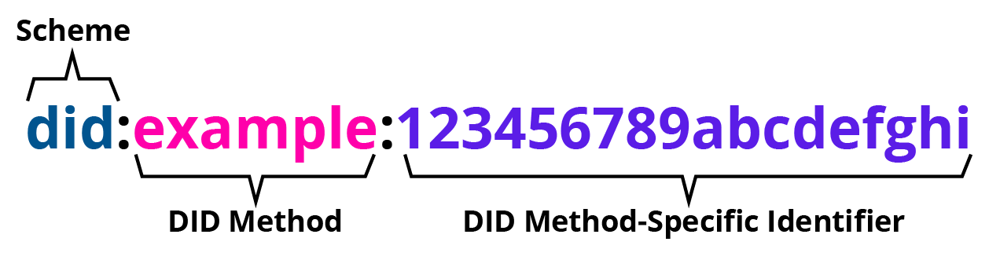
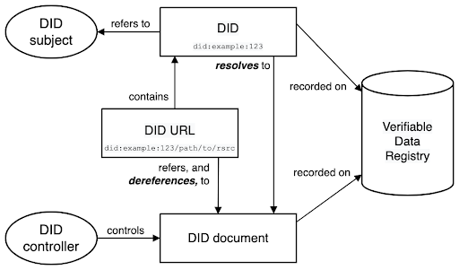

== Decentralized Identifiers (DID)

=== Einführung

Heutzutage verwenden Einzelpersonen oder Organistationen eine vielzahl an weltweit eindeutigen Identifikatoren in vielen Zusammenhängen. Sie dienen als Kommunikationsadressen (Telefonnummern, E-Mail-Adressen, Benutzernamen in sozialen Medien), ID-Nummern (für Pässe, Führerscheine, Steuer-IDs, Krankenversicherungen) und Produktkennungen (Seriennummern, Barcodes, RFIDs). Zb. verwendet jede Webseite, die in einem Browser aufgerufen wird, eine weltweit eindeutige URL (Uniform Resource Locator).

Die überwiegende Mehrheit dieser weltweit eindeutigen Bezeichner unterliegt nicht unserer eigenen Kontrolle. Sie werden von externen Behörden vergeben, die entscheiden, auf wen oder was sie sich beziehen und wann sie widerrufen werden können. Sie sind nur in bestimmten Kontexten nützlich und werden nur von bestimmten Stellen anerkannt, die wir nicht selbst bestimmen können. Sie können mit dem Scheitern einer Organisation verschwinden oder ihre Gültigkeit verlieren. Sie können unnötigerweise persönliche Informationen preisgeben. In vielen Fällen können sie von einem böswilligen Dritten in betrügerischer Absicht vervielfältigt und geltend gemacht werden, was allgemein als "Identitätsdiebstahl" bekannt ist.

Dezentralen Identifikatoren (DIDs) sind eine neue Art von weltweit eindeutigen Identifikatoren. Sie sollen es Einzelpersonen und Organisationen ermöglichen, ihre eigenen Identifikatoren mit Hilfe von Systemen zu erzeugen, denen sie vertrauen. Diese neuen Identifikatoren ermöglichen es Entitäten, die Kontrolle über sie zu beweisen, indem sie sich mit kryptographischen Beweisen wie digitalen Signaturen authentifizieren.

=== Ein einfaches Beispiel

Eine DID ist eine einfache Textzeichenfolge, die aus drei Bestandteilen besteht: 

* dem did-URI-Schema-Bezeichner
* dem Bezeichner für die DID-Methode
* dem DID-methodenspezifischen Bezeichner.

Das obige DID-Beispiel führt zu einem DID-Dokument. Ein DID-Dokument enthält Informationen, die mit der DID verbunden sind, z.B. Möglichkeiten zur kryptografischen Authentifizierung eines DID-Controllers.

----
{
  "@context": [
    "https://www.w3.org/ns/did/v1",
    "https://w3id.org/security/suites/ed25519-2020/v1"
  ]
  "id": "did:example:123456789abcdefghi",
  "authentication": [{
    // used to authenticate as did:...fghi
    "id": "did:example:123456789abcdefghi#keys-1",
    "type": "Ed25519VerificationKey2020",
    "controller": "did:example:123456789abcdefghi",
    "publicKeyMultibase": "zH3C2AVvLMv6gmMNam3uVAjZpfkcJCwDwnZn6z3wXmqPV"
  }]
}
----

Weitere Errklärungen dazu im nächsten Abschnitt.

=== Architektur Überblick

Wie vorab bereits erwähnt, kann sich die DID auf ein beliebiges DID-Subjekt beziehen, z.B. eine Person, eine Organisation oder eine Sache. Im Gegensatz zu zentral verwalteten Identifikatoren aus privaten Namensräumen (z.B. gmail, linkedin, twitter, ein Firmenname usw.) oder global verwalteten Registern (z.B. Telefonnummern, DNS) sind DIDs von zentralisierten Registern, Identitätsanbietern und Zertifizierungsstellen entkoppelt. Sie alle können DIDs verwenden, wie sie wollen, aber dagegen kann ein DID-Kontrolleur seine Kontrolle über eine DID nachweisen, "ohne die Erlaubnis einer anderen Partei zu benötigen".

*DIDs and DID URLs*

Ein dezentraler Bezeichner (Decentralized Identifier, DID) ist ein URI, die aus drei Teilen besteht: 

* dem Schema did:
* einem Methodenbezeichner
* einem eindeutigen, methodenspezifischen Bezeichner

der durch die DID-Methode festgelegt wird. DIDs sind in DID-Dokumente auflösbar. Eine DID-URL erweitert die Syntax eines grundlegenden DID um andere Standard-URI-Komponenten wie Pfad, Abfrage und Fragment, um eine bestimmte Ressource zu lokalisieren - beispielsweise einen kryptografischen öffentlichen Schlüssel innerhalb eines DID-Dokuments oder eine Ressource außerhalb des DID-Dokuments. 

_did:example:123456789abcdefghi/path/to/rsrc_

*DID subjects* 

Das Subjekt einer DID ist per Definition die durch die DID identifizierte Entität. Das DID-Subjekt kann auch der DID-Controller sein. Alles kann das Subjekt einer DID sein: eine Person, Gruppe, Organisation, eine Sache oder ein Konzept.

*DID controllers*

Der Controller eines DID ist die Entität (Person, Organisation oder autonome Software), die die Fähigkeit hat - wie durch eine DID-Methode definiert - Änderungen an einem DID-Dokument vorzunehmen. Diese Fähigkeit wird in der Regel durch die Kontrolle eines Satzes von kryptografischen Schlüsseln durch eine Software, die im Namen des Controllers handelt, geltend gemacht, obwohl sie auch durch andere Mechanismen geltend gemacht werden kann. Es ist zu beachten, dass ein DID mehr als eine Kontrollstelle haben kann, und das DID-Subjekt kann die DID-Kontrollstelle oder eine von ihnen sein.

*Verifiable data registries*

Damit DIDs in DID-Dokumente aufgelöst werden können, werden sie in der Regel in einem zugrunde liegenden System oder Netzwerk gespeichert. Unabhängig von der verwendeten Technologie wird jedes derartige System, das die Aufzeichnung von DIDs und die Rückgabe der für die Erstellung von DID-Dokumenten erforderlichen Daten unterstützt, als überprüfbares Datenregister bezeichnet. Beispiele hierfür sind verteilte Ledger, dezentrale Dateisysteme, Datenbanken jeder Art, Peer-to-Peer-Netzwerke und andere Formen der vertrauenswürdigen Datenspeicherung.

*DID documents*

DID-Dokumente enthalten Informationen, die mit einer DID verbunden sind. Sie drücken typischerweise Überprüfungsmethoden, wie kryptographische öffentliche Schlüssel, und Dienste aus, die für Interaktionen mit dem DID-Subjekt relevant sind.

*DID methods*

DID-Methoden sind der Mechanismus, mit dem eine bestimmte Art von DID und das zugehörige DID-Dokument erstellt, aufgelöst, aktualisiert und deaktiviert werden.

*DID resolvers and DID resolution*

Ein DID-Auflöser ist eine Systemkomponente, die eine DID als Eingabe annimmt und ein konformes DID-Dokument als Ausgabe erzeugt. Dieser Prozess wird als DID-Auflösung bezeichnet.

*DID URL dereferencers and DID URL dereferencing*

Ein DID-URL-Dereferencer ist eine Systemkomponente, die eine DID-URL als Eingabe annimmt und eine Ressource als Ausgabe produziert.
