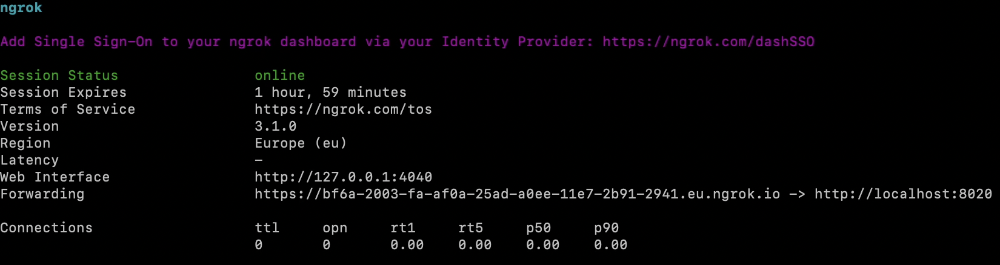
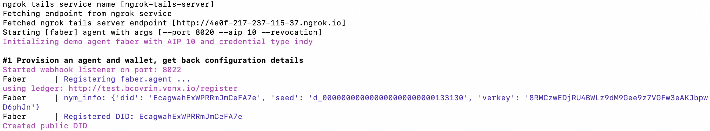
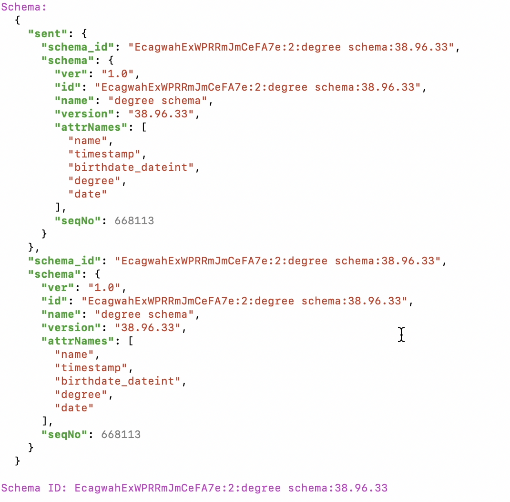
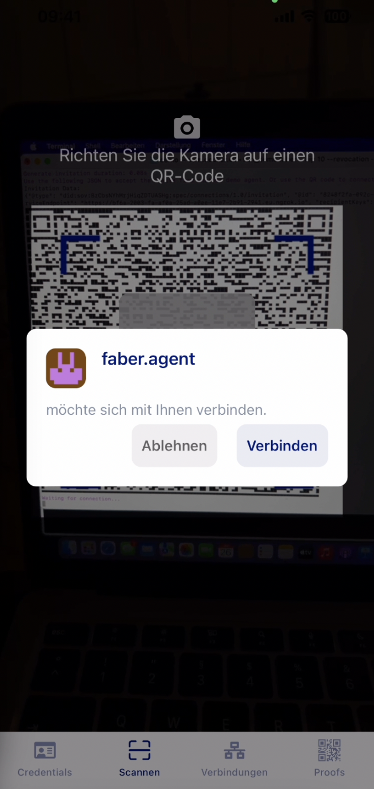
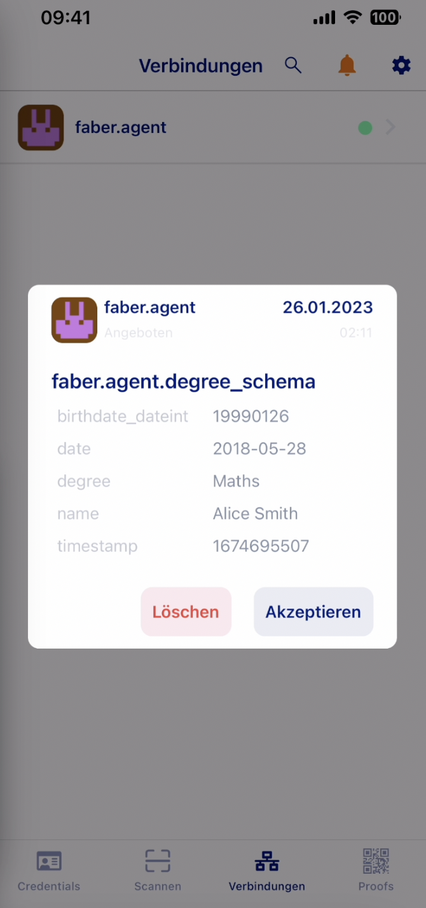
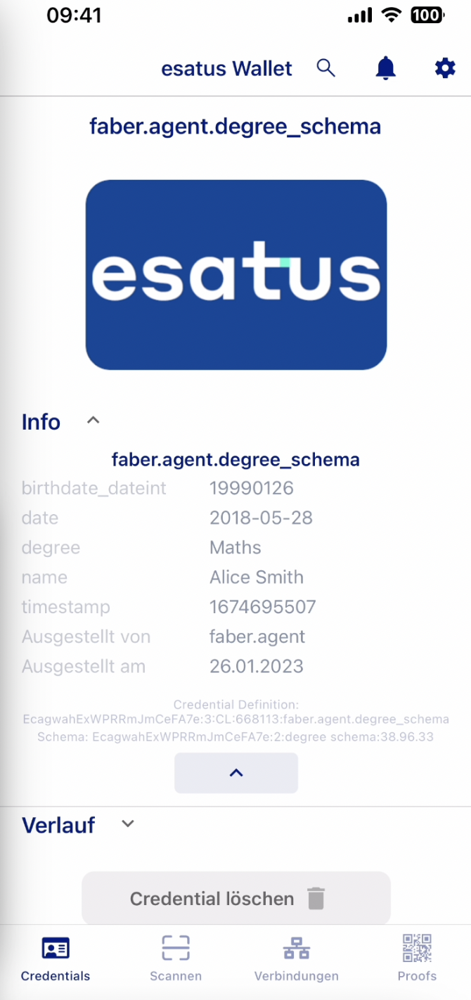

// == Proof-of-Conecpt

Um das Konzept von SSI in seiner Machbarkeit und seinem Potenzial zur Umsetzung zu belegen, wollen wir eine eine praktische Demonstration dieser Technologie umsetzen. Es handelt sich dabei um einen einfache experimentellen Ansatz, um die Funktionsfähigkeit dieses Konzeptes zu testen. Der Zweck dieses PoC ist es, ein besseres Verständnis für die technischen und geschäftlichen Auswirkungen von SSI zu gewinnen.

Dazu nutzen wir das Hyperledger Aries Framework, welches für die Entwicklung von Interoperable Identity Solutions innerhalb des Hyperledger-Projekts eingesetzt wird. Es ist eine Bibliothek von Protokollen, Formaten und Komponenten, die es Entwicklern erleichtern, Anwendungen für Verifiable Credentials und die Übertragung von Informationen in einer SSI-Umgebung zu erstellen. Das Framework basiert auf dem DIDComm Protokoll und beinhaltet dessen technologischen Umsetzung.

Hyperledger Aries unterstützt zudem eine Vielzahl von Identity-Systemen, einschließlich Decentralized Identifier (DID) und Verifiable  Credentials. Es bietet eine einheitliche API für die Übertragung von Daten zwischen verschiedenen Identity-Systemen, die Interoperabilität und Austauschbarkeit gewährleisten. Das Hyperledger Aries-Framework bietet auch Funktionen wie Identitätsmanagement, Übertragung von Daten, Schlüsselverwaltung und mehr, die für die Entwicklung von Anwendungen erforderlich sind, die auf SSI basieren.

Um das Ganze anschaulicher zu Demonstrieren, wollen dazu die https://github.com/hyperledger/aries-cloudagent-python/blob/main/demo/AliceGetsAPhone.md[Alice Gets a Mobile Agent!] Demo von Hyperledger Aries verwenden. In dieser Demo werden wir 2 Standardszenarien simulieren.

=== Szenarien

(1.) *Das Ausstellen von Credentials*

Im ersten Szenario baut Alice eine Verbindung zu Ihrer Hochschule durch die Annahme einer Einladung in Form eines QR-Codes auf. Im zweiten Schritt sendet ihre die Hochschule Verifiable Credentials zu, welche das Datum ihres Abschlusses und das Studienfach beinhalten. Das Szenario ist im Folgenden nochmals als Ablauf grafisch dargestellt.

// Image 1 einfügen

(2.) *Verifizierung der Credentials*

Im zweiten Szenario möchte sich Alice bei einem neuen Arbeitgeber bewerben. Dazu muss sie nachweisen, dass sie tatsächlich über einen Abschluss in Mathematik verfügt. Ihr Arbeitgeber fordert Sie dazu auf, ihr Credentials zuzusenden. Alice kann den Umfang der geforderten Daten vorab einsehen und diese bestätigen. Ein *Selective Attribute Disclosure* wird in dieser Demo nicht gezeigt.

Diese Credentials werden wiederrum durch den Arbeitgeber, mit dem  Abgleich der DID der Hochschule als Issuer der Credetials aus dem Verifiable Data Register, verifiziert und bestätigt.

// Image 3 einfügen

=== Komponenten

Um beide Szenarien technisch umsetzen zu können, benötigen wir mehrere Komponenten, die wir erstellen und nach simulieren müssen.

Alice:: Damit wir Alice simulieren können, verwenden wir ein geeignetes Smartphone (iPhone 13) auf dem ein Wallet installiert ist, welches über einen eigenen Agent kommuniziert.

Wallet/Agent:: Beim Wallet haben wir uns für das *esatus Wallet* entschieden. Esatus ist eine Eigenentwicklung der esatus AG, welche ein Treiber von Self-Sovereign Identity (SSI) in Deutschland und einer der globalen Technologieführer ist. Das Wallet bietet für die Demonstration folgenden Funktionsumfang:

. Das Scannen eines QR-Codes (Einladungen der Hochschule)
. Verbindungsaufbau und zu einem anderen Agent (Hochschule/Arbeitgeber)
. Die Verwaltung von Verbindungen
. Die Möglichkeit ein Test-Ledger auszuwählen (BCGov Test Ledger/BCovrin)
. Das halten, speichern und vorzeigen von Credentials

-> Darüber hinaus werden auch noch weitere Funktionen angeboten, die wir im Umfang dieser Demonstration jedoch nicht betrachten werden.

Hochschule:: Damit wir unseren Issuer, die Hochschule, nach simulieren können, müssen wir diese als Agent lokal installieren und simulieren. Dieser verfügt dann über folgende Funktionen.

* Issue Credential
* Send Proof Request
* Send *Connectionless* Proof Request
* Send Message
* Create New Invitation
* Revoke Credential
* Publish Revocations
* Toggle tracing in credential/proof exchange

-> Für die Simulation verwenden wir die ersten 2 Funktionen.

Arbeitgeber:: Der Arbeitgeber wird auf die gleiche Weise wie die Hochschule simuliert. Wir beschränken uns dabei auf *einen lokalhost*, welcher gleichzeitig Arbeitgeber und Hochschule simuliert. In einem Real Case Szenraio wären diese zwei getrennte Parteien. Der Issuer (Hochschule) und der Verifier (Arbeitgeber) der im OIDC Kontext dann die Reyling Party darstellt.

ngrok:: Ngrok ist ein Tunneling-Service, mit dem Entwickler lokale Anwendungen und Dienste über das Internet verfügbar machen können, ohne sie direkt bereitstellen zu müssen. Es ermöglicht es, eine lokale Anwendung über eine öffentliche URL erreichbar zu machen, was beispielsweise für die Überprüfung von Anwendungen durch andere Benutzer oder das Debugging von Problemen nützlich sein kann. Wir verwenden Ngrok um ein Tunneling-Service nach außen für unseren localhost Agent für die *"Alice Gets a Mobile Agent!"* Demo zu bauen.

BCovrin (Ledger):: http://test.bcovrin.vonx.io[BCoverin] ist ein Test-Ledger, welches bei der Initiallisierung unserer *"Alice Gets a Mobile Agent" Anwendung als Ledger ausgewählt werden kann.

Indy Tails Server:: Indy Tails ist ein Projekt innerhalb der Hyperledger Indy Community, das sich auf die Bereitstellung von Anonymität und Datenschutz in der Identitätsbranche konzentriert. Ein https://github.com/bcgov/indy-tails-server[Indy Tails Server] ist ein Server, der Teil des Indy Tails-Projekts ist und Anwendern Anonymität bei der Verwendung von Hyperledger Indy-basierten Identitätslösungen bietet. Es handelt sich dabei um einen anonymen Proxy-Server, der eine Verbindung zwischen Anwendern und einer Hyperledger Indy-basierten Identitätslösung herstellt. Durch die Verwendung eines Indy Tails-Servers können Anwender ihre Identitätsdaten und ihre Online-Aktivitäten schützen, indem sie ihre echte Identität verborgen halten und stattdessen eine anonyme Identität verwenden.

*=> Daraus ergibt sich der folgender technische Aufbau*

// Image Technischer Aufbau

=== Technische Umsetzung

(1.) *Initialisierung Indy Tails Server*

Zuerst muss der Indy Tails Server initialisiert werden. Dazu wird ein Dockerimage gebaut, welches wiederum später von unserem lokalen Agent als Serverinstanz genutzt werden kann.

(2.) *Aufbau einer Bridge (ngrok)*

Um im späteren Verlauf lokal mit unserem Agent nach außen kommunizieren zu können, müssen vorab über ngrok ein http Bridge aufbauen. Dabei findet ein Portmapping statt.

    https://bf6a-2003-fa-af0a-25ad-a0ee-11e7-2b91.eu.ngrok.io -> http://localhost:8020

(3.) *Initialisierung des lokalen Agents*

Über das Tails Netzwerk wird ein Agent initialisiert, welcher wiederum BCovrin als Test Ledger nutzt. Der folgende Befehl zeigt die detaillierte Initialisierung. Auf die einzelnen Parameter wollen wir in diesem Kontext nicht weiter auführlich eingehen.

    TAILS_NETWORK=docker_tails-server LEDGER_URL=http://test.bcovrin.vonx.io ./run_demo faber --aip 10 --revocation --events

(4.) *Installation des esatus Wallets*

Zuletzt müssen wir noch ein Wallet auf unserem Smartphone installieren. Die Installation findet klassich über den App-Store oder Play-Store. Dabei sind keine Spezifischkeiten zu beachten. Nach erfolgreicher Installation muss das Wallet auf das BCGov Test Ledger (BCovrin) umgestellt werden.

=== Ergebnis

Nachdem wir die technsichen Grundlagen für unsere Demonstration geschaffen haben, wollen wir zuletzt einen Auszug aus der *"Alice Gets a Mobile Agent!"* Demo zeigen.

(1.) *Start der ngrok Bridge*

Zu erkennen ist vor allem das Mapping der lokalen Adresse (localhost:8020) auf eine öffentlich zugängliche URL.

(2.) *Provisionierung eines Agents und einer Wallet*

Als nächstes wird Tails Server gestartet und die Endpunkte des Servers mit ngrok gefetcht, so dass dieser einen neuen Endpunkt für die Kommunikation nach außen mit ngrok als Verbindungsbrücke erhält.

Danach werden wiederrum Agent und Wallet provisioniert, indem eine neue DID erzeugt wird, wleche wiederum im Test Ledger (test.bcoverin) registriert wird.

(3.) *Erfolgreiche Provisionierung*

Nach erfolgreicher Provisionierung werden die Daten für den Agent und dem Wallet einschließlich der öffentlichen DID Information angezeigt.

(4.) *Schema und weitere Einstellunge*

Im Anschluss wird das Schema geladen, welches später für die Erzeugnung der Credentials verwendet wird. Es werden zusätzliche Konfigurationen abgeschlossen, die in dieser Darstellung jedoch nicht abgebildet sind.

(5.) *Erstellung einer Einladung*

Nach erfolgreichen Abschluss aller Konfigurationen wird eine einmalige Einladung erstellt, die über einen mobilen Agenten (vorzugsweise Alice) gescannt werden kann. Danach hat Alice die Möglichkeit die Verbindung anzunehmen oder abzulehnen.

(6.) *Aufbau einer Verbindung zwischen Alice und dem Hochschul Agenten*

Nachdem Alice die Einladung angenommen hat, wird eine Verbindung zwischen dem Agenten von Alice und dem Agenten der Hochschule hergestellt. Diese Verbindung besteht Peer-to-Peer.

(7.) *Austellung der Credentials*

Sowohl Alice hat nun die Möglichkeit Credentials anzufordern, als auch die Hochschule besitzt die Möglichkeit diese eigenständig azustellen. Dabei kann Alice die Korrektheit dieser Daten überprüfen und diese auch jederzeit ablehnen. Sie ist nicht dazu gezwungen diese auch annehmen zu müssen. Damit behält Alice ihre Datenhohheit.

(8). *Speicherung der Credentials*

Die Credentials werden im eigenen persönlichen Wallet von Alice dezentral (aus Netzwerkperspektive) und zentral (aus ihrer eigenen Perspektive) gespeichert und sind dadurch lokal für Alice jederzeit abrufbar. 

(9.) *Überprüfung der Credentials*

Wichtig ist dabei vor allem die Überprüfung der Credentials. Dies geschieht durch dei Zertifizierung des Ausstellers. In diesem Demo Beispiel ist Aussteller (Hochschule) und Verifizierer (Arbeitgeber) der selbe Agent. In einem Real-Case-Szenario findet die Verifizierug durch die DID des Ausstellers im Ledger statt.

=== Beurteilung

Die Demo stellt eine vereinfachte Implementierung von SSI da. Das Grundkonzept wird damit veranschaulicht, jedoch werden nicht alle Parteien über verschiedene Agents simuliert. Auch wird keine detaillierte Überprüfung der DID im Ledger gezeigt, was wiederum wesentlicher Bestandteil für die Verifizierung von Credentials ist. Diese Vorgehensweise bleibt in einer Blackbox verborgen. Dennoch kann die Demo als ein Grundverständnis für SSI genutzt werden.

Über das Hyperledger Aries Framework lassen sich dan spezifischere Anwendungen bauen, erweitern und auf Real-Case.Szenrien anpassen. Dazu braucht es jedoch eine intensive Einarbeitung in das DIDComm Protokoll, ein tiefes Verständnis für SSI und einen starken Technologichen Bachground. Die Implementierung von SSI ist daher wesentlich aufwendiger als das standardmäßige OICD, jedoch lohnen sich dei Vorteile aus Sich des Nutzers enorm. 

Da nicht nur Personen von SSI profetieren können, sondern auch UseCases für Unternehmen und selbst Objekte existieren, die eine Implementierung von SSI als sinnvoll erachten, wollen wir zuletzt einige sinnvolle Szenarien für die Implementierung von SSI vorstellen und ergänzen.

==== SSI für Personen

...

==== SSI für Organisationen

...

==== SSI für Objekte

...